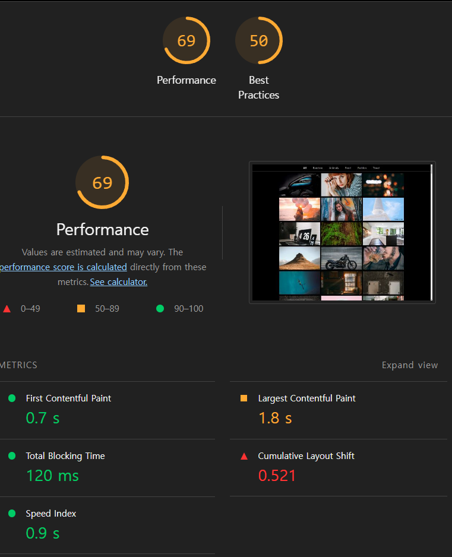

## Lecture-4

## 학습할 기법

### 이미지 지연 로딩

이미지 지연 로딩 라이브러리를 사용해서 이미지가 화면에 표시되는 시점에 맞춰 이미지를 로드할 수 있다.

### 레이아웃 이동 피하기

레이아웃 이동이란 화면 상의 요소 변화로 레이아웃이 갑자기 밀리는 현상을 말한다. 특히 이미지 로딩과정에서 이동이 많이 발생하는데, 사용자 경험에 좋지 않으므로 이동을 피하는 것이 좋다.

### 리덕스 렌더링 최적화

다양한 상태 관리 라이브러리 중 많이 사용되는 리덕스에서 useSelector라는 훅을 사용해 리덕스에 저장된 데이터를 가져오는데, 이 과정에서 다양한 성능 문제가 발생할 수 있다. 이 문제를 해결하고 효율적으로 사용할 수 있는 방법을 익히자.

### 병목 코드 최적화

로직을 개선하는 방법 뿐만 아니라 메모이제이션을 적용하여 성능 문제를 최적화할 수 있다.

## 분석 툴 소개

### React Developer Tools(Profiler)

Profiler 패널과 Componenets 패널로 나뉜다. Profiler 패널을 사용해 리액트 프로젝트를 분석해 얼마만큼의 렌더링이 발생하였고 어떤 컴포넌트가 렌더링 되었는지, 어느 정도의 시간이 소요되었는지 플레임 차트로 확인할 수 있다.

## 서비스 탐색 및 코드 분석

문제: 이미지 뒤에 배경 색이 이미지의 전체적인 색상과 비슷하게 맞춰지는 데, 이미지가 늦게 뜨고 이미지가 뜨고 한참 뒤에야 배경 색이 변함

1. 사용자 이미지 클릭
2. 리덕스에 SHOW_MODAL 액션을 보내고 modalVisible 값을 true로 변경
3. 해당 값을 구독하고 있던 ImageModalContainer에서 값을 불러와 ImageModal 컴포넌트로 전달
4. ImageModal 컴포넌트는 해당 이미지를 모달과 함께 화면에 띄움
5. 이미지가 완전히 로드되면 다시 getAverageColorOfImage를 통해 이미지ㄹ의 평균 생상을 구하고 해당 값을 리덕스에 저장
6. 리덕스 스토어의 상태는 다시 변하므로 최종적으로 변경된 bgColor를 ImageModal까지 전달

```jsx
export function getAverageColorOfImage(imgElement) {
  const canvas = document.createElement('canvas');
  const context = canvas.getContext && canvas.getContext('2d');
  const averageColor = {
    r: 0,
    g: 0,
    b: 0,
  };

  if (!context) {
    return averageColor;
  }

  const width = (canvas.width =
    imgElement.naturalWidth || imgElement.offsetWidth || imgElement.width);
  const height = (canvas.height =
    imgElement.naturalHeight || imgElement.offsetHeight || imgElement.height);

  context.drawImage(imgElement, 0, 0);

  const imageData = context.getImageData(0, 0, width, height).data;
  const length = imageData.length;

  for (let i = 0; i < length; i += 4) {
    averageColor.r += imageData[i];
    averageColor.g += imageData[i + 1];
    averageColor.b += imageData[i + 2];
  }

  const count = length / 4;
  averageColor.r = ~~(averageColor.r / count); // ~~ => convert to int
  averageColor.g = ~~(averageColor.g / count);
  averageColor.b = ~~(averageColor.b / count);

  return averageColor;
}
```

이미지의 픽셀 값의 평균을 계산 하는 함수인데 캔버스를 생성해 이미지를 그린 뒤 픽셀 값을 가져오고 모든 픽셀에 대해 평균 값을 구하고 있다.

## 레이아웃 이동 피하기

### 레이아웃 이동이란

이미지 갤러리 서비스를 새로고침해보면 이미지가 로드될 때 아래 이미지보다 늦게 로드되는 경우, 뒤늦게 아래 이미지를 밀어내면서 화면에 그린다. 페이지가 로드되는 순간 이상하게 뚝뚝 끊기면서 밀린다. 레이아웃 이동은 사용자의 주의를 산만하게 만들고 의도와 다른 클릭을 유발할 수 있다. 이 때문에 Lighthouse에서는 이를 측정하는 지표롤 CLS(Cumulative Layout Shift) 항목을 두고 성능 점수에 포함한다.



### CLS(Cumulative Layout Shift)

- 0~1의 값
- 0 - 레이아웃 이동이 전혀 발생하지 않은 상태 1- 그 반대의 상태
- 권장 점수 0.1

CLS가 0.521으로 매우 나쁜 것을 확인할 수 있다.

직접적인 원인을 파악하기 위해 Performance 패널을 보면 Layout Shift라는 이름의 빨간 막대가 표시되는데 해당 시간에 레이아웃 이동이 발생하였다는 의미이다.


### 레이아웃 이동의 원인

- 사이즈가 미리 정의되지 않은 이미지 요소
- 사이즈가 미리 정의되지 않은 광고 요소
- 동적으로 삽입된 콘텐츠
- 웹 폰트 (FOIT, FOUT)

이 서비스에서는 사이즈가 미리 정의되지 않은 이미지 요소 때문에 해당 문제가 발생한다고 볼 수 있다.

### 레이아웃 이동 해결

요소의 사이즈를 지정하면 된다.

1. padding 박스를 만든 후 이미지를 absolute로 띄우는 방식
2. aspect-ratio를 사용하는 방식 - 브라우저 일부 버전에서는 지원하지 않을 수 있음

```jsx
import React from 'react';
import styled from 'styled-components';
import { useDispatch } from 'react-redux';
import { showModal } from '../redux/imageModal';

function PhotoItem({ photo: { urls, alt } }) {
  const dispatch = useDispatch();

  const openModal = () => {
    dispatch(showModal({ src: urls.full, alt }));
  };

  return (
    <ImageWrap>
      <Image src={urls.small + '&t=' + new Date().getTime()} alt={alt} onClick={openModal} />
    </ImageWrap>
  );
}

const ImageWrap = styled.div`
  width: 100%; // 상위 컴포넌트에서 너비 정해짐
  position: relative;
  padding-bottom: 56.25%;
`;

const Image = styled.img`
  position: absolute;
  cursor: pointer;
  width: 100%;
  height: 100%;
  top: 0;
  left: 0%;
`;

export default PhotoItem;
```

16:9의 비율로 박스를 만들어 주기 위해 padding-bottom을 56.25%로 주면 영역이 잡힌다.


CLS가 0으로 되면서 점수가 좋아졌다.

## 이미지 지연 로딩

react-lazyload라는 라이브러리를 사용해서 이미지 지연 로딩을 적용할 수 있다.

```jsx
npm install --save react-lazyload
```

해당 라이브러리를 설치한 뒤 지연 로드하고싶은 컴포넌트를 감싸주면 된다.

물론 IntersectionObserver API로 구현할 수 있지만 구현하는 데 시간이 필요하므로 라이브러를 사용하면 편리하게 지연 로드할 수 있다.

이미지가 화면에 들어오는 시점보다 조금 더 미리 이미지를 불러와 화면에 들어온 시점에 이미지가 준비되어 있도록 하기 위해 offset 옵션을 사용한다.

offset을 1000으로 설정하면 화면에 들어오기 1000px 전에 이미지를 로드한다.

```jsx
import React from 'react';
import styled from 'styled-components';
import { useDispatch } from 'react-redux';
import { showModal } from '../redux/imageModal';
import LazyLoad from 'react-lazyload';

function PhotoItem({ photo: { urls, alt } }) {
  const dispatch = useDispatch();

  const openModal = () => {
    dispatch(showModal({ src: urls.full, alt }));
  };

  return (
    <ImageWrap>
      <LazyLoad offset={1000}>
        <Image src={urls.small + '&t=' + new Date().getTime()} alt={alt} onClick={openModal} />
      </LazyLoad>
    </ImageWrap>
  );
}

const ImageWrap = styled.div`
  width: 100%; // 상위 컴포넌트에서 너비 정해짐
  position: relative;
  padding-bottom: 56.25%;
`;

const Image = styled.img`
  position: absolute;
  cursor: pointer;
  width: 100%;
  height: 100%;
  top: 0;
  left: 0%;
`;

export default PhotoItem;
```

## 리덕스 렌더링

### 리액트의 렌더링

리액트는 렌더링 사이클을 갖는다. 상태가 변경되면 리랜더링 과정을 거치는 데 렌더링에 시간이 오래 걸리는 코드가 있거나 불필요한 리렌더링이 발생하면 메인 스레드의 리소스를 차지해 서비스 성능에 영향을 줄 수 있다. 이를 분석해보기 위해 React Developer Tools를 사용할 수 있다.

Components 패널의 설정에 Highlight updates when components render 항목을 체크하면 리렌더링이 되는 컴포넌트에 표시가 된다.

이미지를 클릭해서 모달을 띄운 경우에 모달만 렌더링이되는 것이 아니라 전혀 상관이 없는 헤더와 이미지 리스트 컴포넌트까지 리렌더링이 되고 있는 것을 확인할 수 있다.


- 모달을 띄우는 순간
- 배경색이 바뀌는 순간
- 모달을 닫는 순간

지금은 규모가 크지 않아서 잘 느껴지지 않을 수 있지만 리렌더링에 많은 리소스를 사용하게 된다면 서비스 이용 시 버벅 거리는 느낌을 줄 수 있다.

### 리렌더링의 원인

리덕스 상태 변화 때문이다. 상식적으로는 서로 전혀 영향을 주지 않아야 하는 상태를 구독하고 있음에도 불구하고 리렌더링이 되는 이유는 useSelector의 동작 방식 때문이다.

useSelector는 서로 다른 상태를 참조할 때는 리렌더링을 하지 않도록 구현되어 있다. 그 판단 기준이 useSelector에 인자로 넣은 함수의 반환 값이다.

```jsx
const { photos, loading } = useSelector(state => ({
  photos:
    state.category.category === 'all'
      ? state.photos.data
      : state.photos.data.filter(photo => photo.category === state.category.category),
  loading: state.photos.loading,
}));
```

인자로 들어간 함수가 객체를 반환하는 것을 볼 수 있다. 항상 새로운 객체, 참조를 반환하기 때문에 상관없는 리덕스의 상태 변화에도 리렌더링이 발생하게 된다.

### useSelector 문제 해결

- 객체를 새로 만들지 않도록 반환 값 나누기
- 새로운 equality function 사용

**객체를 새로 만들지 않도록 반환 값 나누기**

객체를 변환하지 않는 형태로 useSelector를 나누는 방법이다.

_before_

```jsx
const { modalVisible, bgColor, src, alt } = useSelector(state => ({
  modalVisible: state.imageModal.modalVisible,
  bgColor: state.imageModal.bgColor,
  src: state.imageModal.src,
  alt: state.imageModal.alt,
}));
```

_after_

```jsx
const modalVisible = useSelector(state => state.imageModal.modalVisible);
const bgColor = useSelector(state => state.imageModal.bgColor);
const src = useSelector(state => state.imageModal.src);
const alt = useSelector(state => state.imageModal.alt);
```

_before_

```jsx
const { category } = useSelector(state => ({
  category: state.category.category,
}));
```

_after_

```jsx
const category = useSelector(state => state.category.category);
```

**새로운 Equality Function 사용**

Equality Function은 useSelector의 옵션으로 넣는 함수로 이전 반환 값과 현재 반환 값을 비교하는 함수이다. 직접 구현해도 되고, 리덕스에서 제공하는 함수를 사용할 수도 있다.

```jsx
const { modalVisible, bgColor, src, alt } = useSelector(
  state => ({
    modalVisible: state.imageModal.modalVisible,
    bgColor: state.imageModal.bgColor,
    src: state.imageModal.src,
    alt: state.imageModal.alt,
  }),
  shallowEqual
);
```

```jsx
const { photos, loading } = useSelector(
  state => ({
    photos:
      state.category.category === 'all'
        ? state.photos.data
        : state.photos.data.filter(photo => photo.category === state.category.category),
    loading: state.photos.loading,
  }),
  shallowEqual
);
```

shallowEqual 함수는 객체를 얕은 비교하는 함수이다. 참조 값을 비교하는 것이 아니라 객체 내부에 있는 modalVisible, bgColor, src, alt를 직접 비교해 동일한지 아닌지 판단한다.

하지만 photos와 loading을 가져오는 useSelector의 경우 filter로 인해 항상 새로운 리스트를 가져오게 된다. 이를 피하기 위해 filter함수는 selector 밖에서 사용한다. 이렇게 변경하면 모달을 띄워도 이미지 리스트가 리렌더링 되지 않음을 확인할 수 있다.

```jsx
const { category, allPhotos, loading } = useSelector(
  state => ({
    category: state.category.categorym,
    allPhotos: state.photos.data,
    loading: state.photos.loading,
  }),
  shallowEqual
);

const photos =
  category === 'all' ? allPhotos : allPhotos.filter(photo => photo.category === category);
```

## 병목코드 최적화

### 이미지 모달 분석

- 페이지 최초 로드
- 카테고리 변경할 때
- 이미지 모달을 띄웠을 때

모달이 뜨는 과정에서 메인 스레드의 작업을 확인하려면 화면이 완전 로드된 상태로 performance 탭에서 새로고침 버튼 말고 녹화 버튼을 누른 후 이미지를 클릭 후 모달이 띄워지는 것을 기다린 후에 종료한다.


이미지가 모두 다운로드가 완료되면 getAverageColorOfImage 함수가 실행된다. 작업의 제일 마지막에 Image Decode가 이루어 진다. 이게 완료되어야 이미지가 화면에 뜨기 시작한다.

### getAverageColorOfImage 함수 분석

performance 탭에서 볼 수 있듯, 이 함수가 굉장히 느리다.

1. 큰 이미지 통째로 캔버스에 올림
2. 반복문을 통해 픽셀 정보를 하나하나 더하고 있다.

### 메모이제이션으로 코드 최적화

메모이제이션이란 한번 실행된 함수에 대해 해당 반환 값을 기억해 두고 있다가 똑같은 조건으로 실행되었을 때 함수의 코드를 모두 실행하지 않고 바로 전에 기억해둔 값을 반환 하는 방법이다.

```jsx
const cache = {};
export function getAverageColorOfImage(imgElement) {
  if (cache.hasOwnProperty(imgElement.src)) {
    return cache[imgElement.src];
  }
  const canvas = document.createElement('canvas');
  const context = canvas.getContext && canvas.getContext('2d');
  const averageColor = {
    r: 0,
    g: 0,
    b: 0,
  };

  if (!context) {
    return averageColor;
  }

  const width = (canvas.width =
    imgElement.naturalWidth || imgElement.offsetWidth || imgElement.width);
  const height = (canvas.height =
    imgElement.naturalHeight || imgElement.offsetHeight || imgElement.height);

  context.drawImage(imgElement, 0, 0);

  const imageData = context.getImageData(0, 0, width, height).data;
  const length = imageData.length;

  for (let i = 0; i < length; i += 4) {
    averageColor.r += imageData[i];
    averageColor.g += imageData[i + 1];
    averageColor.b += imageData[i + 2];
  }

  const count = length / 4;
  averageColor.r = ~~(averageColor.r / count); // ~~ => convert to int
  averageColor.g = ~~(averageColor.g / count);
  averageColor.b = ~~(averageColor.b / count);

  cache[imgElement.src] = averageColor;
  return averageColor;
}
```

이렇게 src를 고유한 key로 캐시에 계산 값을 저장할 수 있다.

### 메모이제이션의 단점

메모이제이션은 값을 재활용하는 것이므로 두 번째 실행부터 성능이 향상 되지만, 첫 번째 실행에서는 여전히 느리다. 만약 항상 새로운 인자가 들어오는 함수는 메모이제이션을 적용해도 재활용할 수 있는 조건이 충족되지 않으므로 메모리만 잡아먹는 문제가 발생할 수 있다. 따라서 메모이제이션을 적용할 때는 해당 로직이 동일한 조건에서 충분히 반복 실행이 되는지 체크해야 한다.

### 함수의 로직 개선

이 함수 내에서는 drawImage, getImageData, 그리고 모든 픽셀에 대해 실행되는 반복이 느리게 만드는 요인이다. 이는 사이즈에 영향을 받으므로 작은 이미지를 사용하면 된다. 따라서 원본 이미지 말고, 이미지의 썸네일을 사용해서 작업량을 줄일 수 있다.

```jsx
import React from 'react';
import styled from 'styled-components';
import { useDispatch } from 'react-redux';
import { setBgColor, showModal } from '../redux/imageModal';
import LazyLoad from 'react-lazyload';
import { getAverageColorOfImage } from '../utils/getAverageColorOfImage';

function PhotoItem({ photo: { urls, alt } }) {
  const dispatch = useDispatch();

  const openModal = e => {
    dispatch(showModal({ src: urls.full, alt }));
    const averageColor = getAverageColorOfImage(e.target);
    dispatch(setBgColor(averageColor));
  };

  return (
    <ImageWrap>
      <LazyLoad offset={1000}>
        <Image
          crossOrigin="*"
          src={urls.small + '&t=' + new Date().getTime()}
          alt={alt}
          onClick={openModal}
        />
      </LazyLoad>
    </ImageWrap>
  );
}

const ImageWrap = styled.div`
  width: 100%; // 상위 컴포넌트에서 너비 정해짐
  position: relative;
  padding-bottom: 56.25%;
`;

const Image = styled.img`
  position: absolute;
  cursor: pointer;
  width: 100%;
  height: 100%;
  top: 0;
  left: 0%;
`;

export default PhotoItem;
```

이미지가 클릭 될 때 그 썸네일로 계산하도록 수정했다. 이렇게 하면 원본 이미지가 아닌 썸네일 이미지로 색상 계산을 하기 때문에 더욱 빠르고 원본 이미지를 기다리지 않아도 배경색을 설정할 수 있기 떄문에 병렬적으로 배경색이 설정된다. 이미지 로드 전에 배경색이 설정되는 것을 확인할 수 있다.


